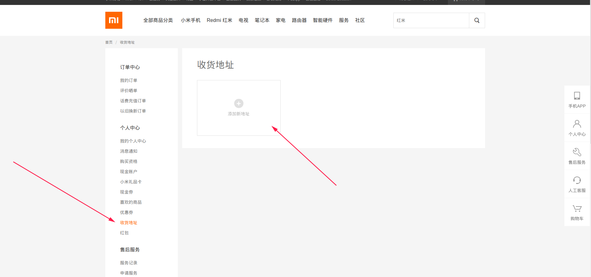

# 小米手机库存检测

- `config-test.json`  测试有库存商品
- `email.js` 发送邮件
- `main.js` 主程序


## 执行步骤

1. 未安装依赖先安装（已安装跳过）

   ```shell
   npm install
   ```

2. 修改[config配置](#config配置)

3. 修改[邮件配置](#邮件配置)

4. 运行

   ```shell
   node main.js
   ```

   

## 依赖

- chrome版本：88.0.xxxx.xx

如果想修改为适应本机chrome版本，按以下操作：

1. 卸载`puppeteer-core`

   ```shell
   npm uninstall puppeteer-core
   ```

2. 查询与当前安装的chrome版本匹配的`puppeteer-core`版本

   https://github.com/puppeteer/puppeteer/blob/main/docs/api.md#puppeteer-vs-puppeteer-core

3. 重新安装`puppeteer-core`

   ```shell
   npm install puppeteer-core@版本号
   ```

   

## config配置

```json
{
	"itemUrl": "商品详情页面地址",
	"username": "登录用户名",
	"password": "登录密码",
	"loginUrl": "https://account.xiaomi.com/pass/serviceLogin",
	"chromeExePath": "chrome浏览器exe文件所在位置/linux对应chrome的执行程序",
	"goodsId": "商品id",
	"itemQueryApiPre": "https://api2.order.mi.com/product/delivery?goods_ids=",
	"itemQueryApiParam":"&item_ids=&收货地区部分参数&t=",
	"options": ["商品页的每个选项下标","从1开始"],
    "batchIndex":"可选，套餐选项下标，数字类型，从1开始",
	"interval": "刷新库存间隔时间，单位秒,如果设置了startTime，则程序执行时间则为startTime+interval",
    "startTime":"可选，如果配置了改值，则按改值的日期开始执行，格式：YYYY-MM-DDTHH:mm:ss"
}
```


## 配置参数获取

浏览器访问`商品详情页面地址` F12打开控制台选择`Network`，按步骤选择好预购买参数，查看发送的请求获取参数


## 设置收货地址

> 需要先登录网页端设置好一个收货地址




## 邮件配置

> 发送邮件的前提是你已经邮箱设置中开启了POP3/SMTP服务
>
> 修改`email.js`

```js
    auth: {
        user: '邮箱登录名',
        pass: '授权码', //注意不是登录密码而是授权码
    },
```

```js
    let info = await transporter.sendMail({
        from: '你的邮箱地址',
        to: "发给谁（邮箱地址）",
        //......
    });
```


## QQ邮箱开启示例

> 依次点击：设置--账户--下拉找到**POP3/IMAP/SMTP/Exchange/CardDAV/CalDAV服务**


## 实现原理

- 使用puppeteer模拟人工点击
- 在商品页面使用setInterval()按照指定的周期向服务器发送查询商品的请求根据响应中的`stock_num`（0/1）判断是否能够购买
- 库纯为1则代表能够购买，则会先点击一次非当前商品（例如其他颜色或版本等）再点击回当前选项以达到刷新按钮的目的（应该比刷新页面要快）
- <span style="color:#E6A23C">抢购商品(没试过，可以将interval设置小一点试一试)</span>